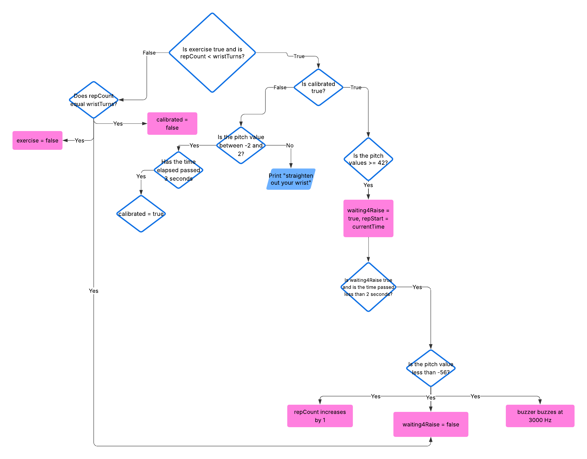
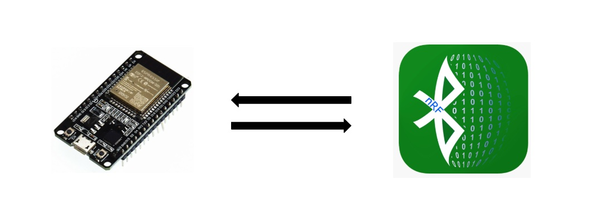
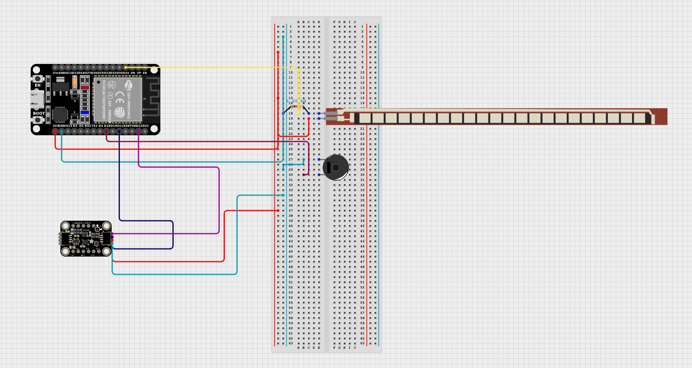
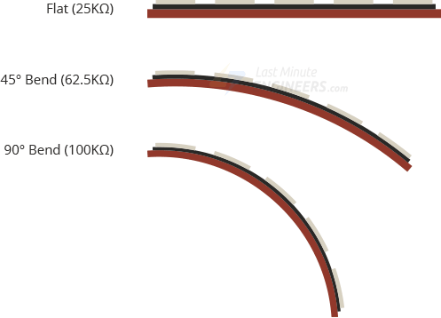
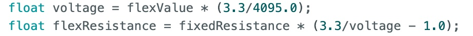
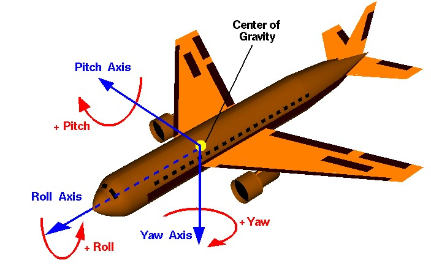

# Wrist Rehabilitation Device
Replace this text with a brief description (2-3 sentences) of your project. This description should draw the reader in and make them interested in what you've built. You can include what the biggest challenges, takeaways, and triumphs from completing the project were. As you complete your portfolio, remember your audience is less familiar than you are with all that your project entails!

You should comment out all portions of your portfolio that you have not completed yet, as well as any instructions:
```HTML 
<!--- This is an HTML comment in Markdown -->
<!--- Anything between these symbols will not render on the published site -->
``` 

| **Engineer** | **School** | **Area of Interest** | **Grade** |
|:--:|:--:|:--:|:--:|
| Danica H | Monta Vista High School | Electrical Engineering | Incoming Junior

<!--- **Replace the BlueStamp logo below with an image of yourself and your completed project. Follow the guide [here](https://tomcam.github.io/least-github-pages/adding-images-github-pages-site.html) if you need help.** -->


  
# Final Milestone

<!--- **Don't forget to replace the text below with the embedding for your milestone video. Go to Youtube, click Share -> Embed, and copy and paste the code to replace what's below.** -->

<iframe width="560" height="315" src="https://www.youtube.com/embed/F7M7imOVGug" title="YouTube video player" frameborder="0" allow="accelerometer; autoplay; clipboard-write; encrypted-media; gyroscope; picture-in-picture; web-share" allowfullscreen></iframe>

<!--- For your final milestone, explain the outcome of your project. Key details to include are:
- What you've accomplished since your previous milestone
- What your biggest challenges and triumphs were at BSE
- A summary of key topics you learned about
- What you hope to learn in the future after everything you've learned at BSE -->


# Second Milestone

<iframe width="560" height="315" src="https://www.youtube.com/embed/SlVOGyVt5ZI?si=1MQGcsITQpj9sgie" title="YouTube video player" frameborder="0" allow="accelerometer; autoplay; clipboard-write; encrypted-media; gyroscope; picture-in-picture; web-share" referrerpolicy="strict-origin-when-cross-origin" allowfullscreen></iframe>

## Description
For my second milestone, I actually changed the function of my accelerometer. Since my flex sensor already functions to monitor the angle of my wrist, I coded it to help monitor the number of wrist turns you do. I also added a piezo buzzer onto my board so it can beep for different purposes. Finally, I incoporated the Bluetooth module that's built on the ESP32 so I can wirelessly transmit information from my phone to the computer and the Arduino. Using the Bluetooth, I added commands that I can type out on my phone to tell the device to do something.

### Piezo Buzzer
The piezo buzzer is an output device, so I tell it what to do in my code. I can control when it beeps, the frequency at which it beeps at, and how long it beeps for. Since I want the buzzer to beep for 3 different purposes, I set a different frequency each time so the user wouldn't be confused on what it's beeping about. For example, if the flex sensor bends past 30 degrees (the threshold I set), it will keep beeping at 1000 Hz until the flex sensor's angle is below 30. On the other hand, if I'm doing wrist turns, the piezo buzzer will beep at 3000 Hz for 500 milliseconds every time I complete a wrist turn.

### How to Monitor Wrist Turns
For the accelerometer, I really didn't change much. I still used the Madgwick filter to convert the values of the gyroscope and the accelerometer into orientations along the roll, pitch, and yaw axes. The only difference was how I used the values along the pitch axes. The code I had to write had a lot of checks and I had to make many global variables. For starters, I needed to make sure that the code block for wrist turns would only run when I commanded it to. I made a boolean called exercise and made it so the code block would only run if exercise was set to true. Next, I made a boolean called calibrated. To make it true, I have to make sure my wrist is straight and the pitch values were between 2 and -2 for at least 3 seconds. Once the device is calibrated, I can start doing my wrist turns. For my wrist turns, I made an another boolean called waiting4Raise. Once my wrist is pointed downwards and has a pitch value that is bigger than 42, waiting4Raise becomes true and a timer starts. waiting4Raise basically means that the device is waiting for me to move my wrist upward, since I already moved it down. If within 2 seconds my wrist is pointed up and the pitch value is less than -56, the rep count increases since that counts as a complete wrist turn. After one wrist turn, waiting4Raise is set back to false. If I have completed all of my wrist turns, exercise is set to false, calibrated is also set to false, and the rep count is set back to 0.


Figure of the flow chart of my wrist turn code

### Bluetooth
Since the ESP32 already has a built in Bluetooth module, I didn't have to use the HC05. Implementing the Bluetooth module was not too complicated. I first downloaded the BleSerial library on Arduino and created a BleSerial object in my code. The BleSerial object is the serial on my phone, and creating it allows me to actually run code that uses it. I then downloaded the BLESerialnRF52 app on my phone, since downloading an app is the only way to open a serial on a phone. I then figured out how to communicate between the two serials using code. It mainly consisted of using the available() function to check if there was data to be read, then using the read() function to read the data. Then with that data I could do whatever I wanted. I realized I could use this communication to write commands on my phone. I tweaked the code so that the device would do things based on the commands I typed on my phone serial. For example, if I typed "start monitoring" on my phone, the device would start monitoring the angle of the flex sensor and allowing the buzzer to beep. Or, if I wanted to do a certain amount of wrist turns, I could type in "do wrist turns" on my serial and also type in how many I want to do.


Figure of the BLESerialnRF52 app and ESP32

## Challenges
One of my challenges was that for some reason, when I was first testing my accelerometer for the wrist turns, the Madgwick filter was updating really slowly even though the frequency it was updating at was already really fast. I even tried upping the frequency, but that didn't change anything. Some time later, the code stopped uploading entirely and my serial port disappeared from my board menu in Arduino even though everything was plugged in. After trying to restart my computer and the Arduino app, I unplugged my device from the first charging port on my computer and plugged it into the second charging port. That charging port probably allowed more connection with the board, because once I plugged it into that port, the serial port showed up again and allowed me to upload code. My accelerometer also started updating at the correct speed when I uploaded my code. The second challenge that I had was when I tried to use the toLowerCase() method in my code. The toLowerCase() method is a void function, which means it doesn't return anything when I call it. But, since in Java though it returns a string, I assumed it was the same in C++. I basically tried to set a variable to nothing, so the code kept giving me errors. I realized that the method updates the string itself, so I needed to first call the method, and then set the variable to that updated string. The third challenge I had was with the write() function when working with the phone and computer serials. The write() function is the print() method, except it converts ASCII values to actual text when it prints. But, write() didn't work for the phone serial, only print() worked. To fix it, instead of using the read() function when reading in data, I used the readStringUntil() function, which automatically returns the string in its text form. Then I just printed that string onto the phone serial.

## Schematic


Schematic for flex sensor, accelerometer, and piezo buzzer

# First Milestone

<iframe width="560" height="315" src="https://www.youtube.com/embed/6mwKerqYJog?si=9e9g_ttw-0v3EGIk" title="YouTube video player" frameborder="0" allow="accelerometer; autoplay; clipboard-write; encrypted-media; gyroscope; picture-in-picture; web-share" referrerpolicy="strict-origin-when-cross-origin" allowfullscreen></iframe>

## Description
For my first milestone, I figured out how to code and wire both the flex sensor and the accelerometer and make them detect when an angle is bad for my wrist. I coded both of them to tell me if I bended my wrist too far back or too far forward. 

### Flex Sensor
The flex sensor is a resistor, and the more it bends the more resistance it will apply. I coded it so that the bend corresponds to the angle of the wrist, so the more it bends, the more the angle increases. It doesn't originally send data as angles though, it sends data as analog data (information sensors send represented by a range of values). I had to attach it to a pin that would convert the data to understandable digital data (values that actually follow Arduino's documentation). This process is basically ADC conversioon. But, since I wanted the data to be in degrees, I then had to use a few equations to convert the digital data in degrees. 


Figure of a flex sensor

### Converting Digital Data to Angles
The first equation I used was (flexValue * (3.3/4095.0)). FlexValue is the digital data that the Arduino outputs, 3.3 is the max analog value (aka voltage) the ESP32 is able to output, and 4095.0 is the corresponding max digital value. This equation helps convert the digital data to voltage. The next equation I used was (10000 * (3.3/voltage - 1.0)). The 10000 is the resistance of the flex sensor when it is straight, the 3.3 is again the max value of voltage the ESP32 can output, and the voltage is the voltage found from the previous equation. The equation is used to convert the voltage to the amount of resistance the flex sensor is applying. After I used those 2 equations to find the resistance, I used a function called map() that actually helps convert those resistance values into angles. The map() function takes in a few parameters so know what resistance value counts as 0 degrees and what counts as 90 degrees. I set the optimal wrist degree to 30 degrees, which means if the flex sensor ever bends past 30 degrees the computer will print out a message warning me to fix my wrist posture. 


Figure of equations that I used

### Accelerometer and Madgwick Filter
For the accelerometer, since it measures both values of a gyroscope (rotation speed) and an accelerometer (acceleration) along the x, y, and z axes, it outputs 6 values at a time. I ended up using a Madgwick filter to help convert all of those values into the orientationos of the object along the roll, yaw, and pitch axes. The roll, pitch, and yaw axes are the main axes that planes use in the air. I again set a threshold for the pitch axis, since the pitch axis is what the wrist technically rotates around. That threshold will also indicate if I need to fix my posture.


Figure of roll, pitch, and yaw axes

## Challenges
One of the challenges was I had was adjusting the conversion equations. The ones I found online were for the Arduino Uno board, and since I'm using the ESP32 board, the equations were giving me the wrong values. The voltage was 5 instead of 3.3, and the corresponding digital was 1023.0 instead of 4095.0. I had to adjust those values according to the ranges of the ESP32. But after I adjusted the values, another problem happened. As I bent the flex sensor, the output values would get smaller instead of larger. After analyzing the equations, I concluded I needed to switch the positions of my resistor and my flex sensor on my breadboard, as the way I had originally placed them caused them to send incorrect values to the equation. Another challenge was that the accelerometer also had a gyroscope, so it was giving me 6 values at a time and I didn't know which of the 6 to use. I realized that Arduino has a library called Madgwick that actually filters those 6 values and gives you the position of the accelerometer along the roll, yaw, and pitch axes. I ended up using that filter and using the values it gave me to set a threshold.

## Next Steps
For my next steps, I will first add a piezo buzzer to my ESP32 so that it will buzz whenever my wrist is too bent. I will also try and incorporate Bluetooth into my project so that the device can wirelessly transmit data to the computer.

## Schematic


Schematic for flex sensor and accelerometer

## Code

Figure 1: Code for first milestone
```c++
// Basic demo for accelerometer/gyro readings from Adafruit LSM6DS3TR-C
const int flexPin = A6;
const int fixedResistance = 10000;
#include <MadgwickAHRS.h>
#include <Adafruit_LSM6DS3TRC.h>

// For SPI mode, we need a CS pin
#define LSM_CS 10
// For software-SPI mode we need SCK/MOSI/MISO pins
#define LSM_SCK 13
#define LSM_MISO 12
#define LSM_MOSI 11

Adafruit_LSM6DS3TRC lsm6ds3trc;
Madgwick filter;

void setup(void) {
  Serial.begin(115200);
  filter.begin(10);
  while (!Serial)
    delay(10); // will pause Zero, Leonardo, etc until serial console opens

  Serial.println("Adafruit LSM6DS3TR-C test!");

  if (!lsm6ds3trc.begin_I2C()) {
    // if (!lsm6ds3trc.begin_SPI(LSM_CS)) {
    // if (!lsm6ds3trc.begin_SPI(LSM_CS, LSM_SCK, LSM_MISO, LSM_MOSI)) {
    Serial.println("Failed to find LSM6DS3TR-C chip");
    while (1) {
      delay(10);
    }
  }

  Serial.println("LSM6DS3TR-C Found!");

  // lsm6ds3trc.setAccelRange(LSM6DS_ACCEL_RANGE_2_G);
  Serial.print("Accelerometer range set to: ");
  switch (lsm6ds3trc.getAccelRange()) {
  case LSM6DS_ACCEL_RANGE_2_G:
    Serial.println("+-2G");
    break;
  case LSM6DS_ACCEL_RANGE_4_G:
    Serial.println("+-4G");
    break;
  case LSM6DS_ACCEL_RANGE_8_G:
    Serial.println("+-8G");
    break;
  case LSM6DS_ACCEL_RANGE_16_G:
    Serial.println("+-16G");
    break;
  }

  // lsm6ds3trc.setGyroRange(LSM6DS_GYRO_RANGE_250_DPS);
  Serial.print("Gyro range set to: ");
  switch (lsm6ds3trc.getGyroRange()) {
  case LSM6DS_GYRO_RANGE_125_DPS:
    Serial.println("125 degrees/s");
    break;
  case LSM6DS_GYRO_RANGE_250_DPS:
    Serial.println("250 degrees/s");
    break;
  case LSM6DS_GYRO_RANGE_500_DPS:
    Serial.println("500 degrees/s");
    break;
  case LSM6DS_GYRO_RANGE_1000_DPS:
    Serial.println("1000 degrees/s");
    break;
  case LSM6DS_GYRO_RANGE_2000_DPS:
    Serial.println("2000 degrees/s");
    break;
  case ISM330DHCX_GYRO_RANGE_4000_DPS:
    break; // unsupported range for the DS33
  }

  // lsm6ds3trc.setAccelDataRate(LSM6DS_RATE_12_5_HZ);
  Serial.print("Accelerometer data rate set to: ");
  switch (lsm6ds3trc.getAccelDataRate()) {
  case LSM6DS_RATE_SHUTDOWN:
    Serial.println("0 Hz");
    break;
  case LSM6DS_RATE_12_5_HZ:
    Serial.println("12.5 Hz");
    break;
  case LSM6DS_RATE_26_HZ:
    Serial.println("26 Hz");
    break;
  case LSM6DS_RATE_52_HZ:
    Serial.println("52 Hz");
    break;
  case LSM6DS_RATE_104_HZ:
    Serial.println("104 Hz");
    break;
  case LSM6DS_RATE_208_HZ:
    Serial.println("208 Hz");
    break;
  case LSM6DS_RATE_416_HZ:
    Serial.println("416 Hz");
    break;
  case LSM6DS_RATE_833_HZ:
    Serial.println("833 Hz");
    break;
  case LSM6DS_RATE_1_66K_HZ:
    Serial.println("1.66 KHz");
    break;
  case LSM6DS_RATE_3_33K_HZ:
    Serial.println("3.33 KHz");
    break;
  case LSM6DS_RATE_6_66K_HZ:
    Serial.println("6.66 KHz");
    break;
  }

  // lsm6ds3trc.setGyroDataRate(LSM6DS_RATE_12_5_HZ);
  Serial.print("Gyro data rate set to: ");
  switch (lsm6ds3trc.getGyroDataRate()) {
  case LSM6DS_RATE_SHUTDOWN:
    Serial.println("0 Hz");
    break;
  case LSM6DS_RATE_12_5_HZ:
    Serial.println("12.5 Hz");
    break;
  case LSM6DS_RATE_26_HZ:
    Serial.println("26 Hz");
    break;
  case LSM6DS_RATE_52_HZ:
    Serial.println("52 Hz");
    break;
  case LSM6DS_RATE_104_HZ:
    Serial.println("104 Hz");
    break;
  case LSM6DS_RATE_208_HZ:
    Serial.println("208 Hz");
    break;
  case LSM6DS_RATE_416_HZ:
    Serial.println("416 Hz");
    break;
  case LSM6DS_RATE_833_HZ:
    Serial.println("833 Hz");
    break;
  case LSM6DS_RATE_1_66K_HZ:
    Serial.println("1.66 KHz");
    break;
  case LSM6DS_RATE_3_33K_HZ:
    Serial.println("3.33 KHz");
    break;
  case LSM6DS_RATE_6_66K_HZ:
    Serial.println("6.66 KHz");
    break;
  }

  lsm6ds3trc.configInt1(false, false, true); // accelerometer DRDY on INT1
  lsm6ds3trc.configInt2(false, true, false); // gyro DRDY on INT2
}

void loop() {
  // Get a new normalized sensor event
  sensors_event_t accel;
  sensors_event_t gyro;
  sensors_event_t temp;
  lsm6ds3trc.getEvent(&accel, &gyro, &temp);

  // Serial.print("\t\tTemperature ");
  // Serial.print(temp.temperature);
  // Serial.println(" deg C");

  // /* Display the results (acceleration is measured in m/s^2) */
  // Serial.print("\t\tAccel X: ");
  // Serial.print(accel.acceleration.x);
  // Serial.print(" \tY: ");
  // Serial.print(accel.acceleration.y);
  // Serial.print(" \tZ: ");
  // Serial.print(accel.acceleration.z);
  // Serial.println(" m/s^2 ");

  // /* Display the results (rotation is measured in rad/s) */
  // Serial.print("\t\tGyro X: ");
  // Serial.print(gyro.gyro.x);
  // Serial.print(" \tY: ");
  // Serial.print(gyro.gyro.y);
  // Serial.print(" \tZ: ");
  // Serial.print(gyro.gyro.z);
  // Serial.println(" radians/s ");
  // Serial.println();

  int flexValue;
  flexValue = analogRead(flexPin);
  float voltage = flexValue * (3.3/4095.0);
  float flexResistance = fixedResistance * (3.3/voltage - 1.0);
  //Serial.println(flexResistance);
  float angle = map(flexResistance, 12000, 28000, 0.0, 90.0);
  Serial.print("angle: ");
  Serial.println(String(angle) + " degrees");
  

  filter.updateIMU(gyro.gyro.x, gyro.gyro.y, gyro.gyro.z, accel.acceleration.x, accel.acceleration.y, accel.acceleration.z);
  Serial.print("Filter angles: ");
  Serial.print(filter.getRoll());
  Serial.print(" ");
  Serial.print(filter.getYaw());
  Serial.print(" ");
  Serial.println(filter.getPitch());
  
  if (filter.getPitch() < -35 || filter.getPitch() > 30 || angle > 30 || angle < -5) {
    Serial.println("fix posture");
  }


  delay(100);

  //  // serial plotter friendly format

  //  Serial.print(temp.temperature);
  //  Serial.print(",");

  //  Serial.print(accel.acceleration.x);
  //  Serial.print(","); Serial.print(accel.acceleration.y);
  //  Serial.print(","); Serial.print(accel.acceleration.z);
  //  Serial.print(",");

  // Serial.print(gyro.gyro.x);
  // Serial.print(","); Serial.print(gyro.gyro.y);
  // Serial.print(","); Serial.print(gyro.gyro.z);
  // Serial.println();
  //  delayMicroseconds(10000);
}
```
Figure 2: Code for second milestone
```c++
// Basic demo for accelerometer/gyro readings from Adafruit LSM6DS3TR-C
const int flexPin = A6;
const int fixedResistance = 10000;
const int buzzer = 18;
unsigned long currentTime = millis();
unsigned long repStart = 0.0;
int repCount = 0;
int wristTurns = 1;
int countSeconds = 0;
bool waiting4Raise = false;
bool calibrated = false;
bool monitor = false;
bool exercise = false;
#include <MadgwickAHRS.h>
#include <Adafruit_LSM6DS3TRC.h>
#include <BleSerial.h>


// For SPI mode, we need a CS pin
#define LSM_CS 10
// For software-SPI mode we need SCK/MOSI/MISO pins
#define LSM_SCK 13
#define LSM_MISO 12
#define LSM_MOSI 11

Adafruit_LSM6DS3TRC lsm6ds3trc;
Madgwick filter;
BleSerial ble;
const float sampleFreq = 20.0;


void setup() {
  Serial.begin(115200);
  filter.begin(sampleFreq);
  ble.begin("danica's serial");
  while (!Serial)
    delay(10); // will pause Zero, Leonardo, etc until serial console opens

  Serial.println("Adafruit LSM6DS3TR-C test!");

  if (!lsm6ds3trc.begin_I2C()) {
    // if (!lsm6ds3trc.begin_SPI(LSM_CS)) {
    // if (!lsm6ds3trc.begin_SPI(LSM_CS, LSM_SCK, LSM_MISO, LSM_MOSI)) {
    Serial.println("Failed to find LSM6DS3TR-C chip");
    while (1) {
      delay(10);
    }
  }

  Serial.println("LSM6DS3TR-C Found!");

  // lsm6ds3trc.setAccelRange(LSM6DS_ACCEL_RANGE_2_G);
  Serial.print("Accelerometer range set to: ");
  switch (lsm6ds3trc.getAccelRange()) {
  case LSM6DS_ACCEL_RANGE_2_G:
    Serial.println("+-2G");
    break;
  case LSM6DS_ACCEL_RANGE_4_G:
    Serial.println("+-4G");
    break;
  case LSM6DS_ACCEL_RANGE_8_G:
    Serial.println("+-8G");
    break;
  case LSM6DS_ACCEL_RANGE_16_G:
    Serial.println("+-16G");
    break;
  }

  // lsm6ds3trc.setGyroRange(LSM6DS_GYRO_RANGE_250_DPS);
  Serial.print("Gyro range set to: ");
  switch (lsm6ds3trc.getGyroRange()) {
  case LSM6DS_GYRO_RANGE_125_DPS:
    Serial.println("125 degrees/s");
    break;
  case LSM6DS_GYRO_RANGE_250_DPS:
    Serial.println("250 degrees/s");
    break;
  case LSM6DS_GYRO_RANGE_500_DPS:
    Serial.println("500 degrees/s");
    break;
  case LSM6DS_GYRO_RANGE_1000_DPS:
    Serial.println("1000 degrees/s");
    break;
  case LSM6DS_GYRO_RANGE_2000_DPS:
    Serial.println("2000 degrees/s");
    break;
  case ISM330DHCX_GYRO_RANGE_4000_DPS:
    break; // unsupported range for the DS33
  }

  //lsm6ds3trc.setAccelDataRate(LSM6DS_RATE_20_HZ);
  Serial.print("Accelerometer data rate set to: ");
  switch (lsm6ds3trc.getAccelDataRate()) {
  case LSM6DS_RATE_SHUTDOWN:
    Serial.println("0 Hz");
    break;
  case LSM6DS_RATE_12_5_HZ:
    Serial.println("12.5 Hz");
    break;
  case LSM6DS_RATE_26_HZ:
    Serial.println("26 Hz");
    break;
  case LSM6DS_RATE_52_HZ:
    Serial.println("52 Hz");
    break;
  case LSM6DS_RATE_104_HZ:
    Serial.println("104 Hz");
    break;
  case LSM6DS_RATE_208_HZ:
    Serial.println("208 Hz");
    break;
  case LSM6DS_RATE_416_HZ:
    Serial.println("416 Hz");
    break;
  case LSM6DS_RATE_833_HZ:
    Serial.println("833 Hz");
    break;
  case LSM6DS_RATE_1_66K_HZ:
    Serial.println("1.66 KHz");
    break;
  case LSM6DS_RATE_3_33K_HZ:
    Serial.println("3.33 KHz");
    break;
  case LSM6DS_RATE_6_66K_HZ:
    Serial.println("6.66 KHz");
    break;
  }

  // lsm6ds3trc.setGyroDataRate(LSM6DS_RATE_12_5_HZ);
  Serial.print("Gyro data rate set to: ");
  switch (lsm6ds3trc.getGyroDataRate()) {
  case LSM6DS_RATE_SHUTDOWN:
    Serial.println("0 Hz");
    break;
  case LSM6DS_RATE_12_5_HZ:
    Serial.println("12.5 Hz");
    break;
  case LSM6DS_RATE_26_HZ:
    Serial.println("26 Hz");
    break;
  case LSM6DS_RATE_52_HZ:
    Serial.println("52 Hz");
    break;
  case LSM6DS_RATE_104_HZ:
    Serial.println("104 Hz");
    break;
  case LSM6DS_RATE_208_HZ:
    Serial.println("208 Hz");
    break;
  case LSM6DS_RATE_416_HZ:
    Serial.println("416 Hz");
    break;
  case LSM6DS_RATE_833_HZ:
    Serial.println("833 Hz");
    break;
  case LSM6DS_RATE_1_66K_HZ:
    Serial.println("1.66 KHz");
    break;
  case LSM6DS_RATE_3_33K_HZ:
    Serial.println("3.33 KHz");
    break;
  case LSM6DS_RATE_6_66K_HZ:
    Serial.println("6.66 KHz");
    break;
  }

  lsm6ds3trc.configInt1(false, false, true); // accelerometer DRDY on INT1
  lsm6ds3trc.configInt2(false, true, false); // gyro DRDY on INT2
  pinMode(buzzer, OUTPUT);
}

void loop() {
  // Get a new normalized sensor event
  sensors_event_t accel;
  sensors_event_t gyro;
  sensors_event_t temp;
  lsm6ds3trc.getEvent(&accel, &gyro, &temp);

  // Serial.print("\t\tTemperature ");
  // Serial.print(temp.temperature);
  // Serial.println(" deg C");

  /* Display the results (acceleration is measured in m/s^2) */
  // Serial.print("\t\tAccel X: ");
  // Serial.print(accel.acceleration.x);
  // Serial.print(" \tY: ");
  // Serial.print(accel.acceleration.y);
  // Serial.print(" \tZ: ");
  // Serial.print(accel.acceleration.z);
  // Serial.println(" m/s^2 ");

  /* Display the results (rotation is measured in rad/s) */
  // Serial.print("\t\tGyro X: ");
  // Serial.print(gyro.gyro.x);
  // Serial.print(" \tY: ");
  // Serial.print(gyro.gyro.y);
  // Serial.print(" \tZ: ");
  // Serial.print(gyro.gyro.z);
  // Serial.println(" radians/s ");
  // Serial.println();
  
  // if there is data to be read from the phone serial
  if (ble.available()) {
    // reads the message until there is a new line
    String message = ble.readStringUntil('\n');
    message.toLowerCase();
    if (message == "start monitoring") {
      monitor = true;
      ble.println("started");
    }
    else if (message == "stop monitoring") {
      monitor = false;
      ble.println("stopped");
    }
    else if (message == "do wrist turns") {
      ble.println("how many?");
      while (!ble.available()) {
        // delay until there is data to be read from the phone (otherwise the code runs so fast it will skip over the phone input) 
        delay(100);
        Serial.print(".");
      }
      String str = ble.readStringUntil('\n');
      ble.println(str);
      wristTurns = str.toInt();
      Serial.println(wristTurns);
      exercise = true;
    }
    else if (message == "menu") {
      ble.println("1. 'start monitoring' - allows the device to monitor the angle of your wrist and beep if the angle is too steep");
      ble.println("2. 'stop monitoring' - the device will stop monitoring the angle of your wrist, mainly used when sleeping");
      ble.println("3. 'do wrist turns' - you will be prompted to enter the amount of wrist turns you do and it will monitor how many you do");
    }
  }

  // will start monitoring the angle of the wrist if monitor is true, will not if it's false
  if (monitor) {
    int flexValue;
    // converts the analog voltage to readable digital data
    flexValue = analogRead(flexPin);
    // converts the digital data to voltage
    float voltage = flexValue * (3.3/4095.0);
    // converts voltage to resistance
    float flexResistance = fixedResistance * (3.3/voltage - 1.0);
    // converts resistance to angle it's bent at
    float angle = map(flexResistance, 12000, 28000, 0.0, 90.0);
    Serial.print("angle: ");
    Serial.println(String(angle) + " degrees");
    if (angle > 30 || angle < -5) {
      ble.println("fix posture");
      // piezo buzzer buzzes
      tone(buzzer, 1000);
    }
    else {
      noTone(buzzer);
    }
  }
  
  // Madgwick filter updates its values
  filter.updateIMU((gyro.gyro.x * 180)/PI, (gyro.gyro.y * 180)/PI, (gyro.gyro.z * 180)/PI, accel.acceleration.x, accel.acceleration.y, accel.acceleration.z);

  // will run if the use wants to do wrist turns
  if (repCount < wristTurns && exercise) {
    // calibrating
    if (!calibrated) {
      if (filter.getPitch() <= 2 && filter.getPitch() >= -2) {
        Serial.print("Filter angles: ");
        Serial.print(filter.getRoll());
        Serial.print(" ");
        Serial.print(filter.getYaw());
        Serial.print(" ");
        Serial.println(filter.getPitch());
        ble.println("Calibrating.....");
        countSeconds++;
        // if the pitch value of wrist is between 2 and -2 for 3 seconds
        if (countSeconds == 60) {
          calibrated = true;
          ble.println("Calibrated! You can begin");
          countSeconds = 0;
        }
      }
      else {
        Serial.print("Filter angles: ");
        Serial.print(filter.getRoll());
        Serial.print(" ");
        Serial.print(filter.getYaw());
        Serial.print(" ");
        Serial.println(filter.getPitch());
        ble.println("Straighten out your wrist");
        countSeconds = 0;
      }
    }
    
    if (calibrated) { 
      // if wrist is pointed down and the pitch value exceeds 42
      if (filter.getPitch() >= 42) {
        // boolean for waiting for the wrist to go up
        waiting4Raise = true;
        // the starting time of the rep
        repStart = currentTime;
      }

      // if waiting4Raise is true and the time between the current time and the start time is less than 2 seconds
      if (waiting4Raise && currentTime - repStart <= 2000) {
        // if the wrist is pointed up and the pitch value is less than -56
        if (filter.getPitch() <= -56) {
          repCount += 1;
          // buzz
          tone(buzzer, 3000, 500);
          ble.println(repCount);
          waiting4Raise = false;
        }
      }
    }
    // the goal has been reached
    if (repCount == wristTurns) {
      ble.println("Congrats! You're done!");
      repCount = 0;
      exercise = false;
      calibrated = false;
      // buzzer indicating that it's done
      tone(buzzer, 4000, 500);
      delay(1200);
      tone(buzzer, 4000, 500);
      delay(1200);
      tone(buzzer, 4000, 500);
    }
  }


  delay(50);

  //  // serial plotter friendly format

  //  Serial.print(temp.temperature);
  //  Serial.print(",");

  //  Serial.print(accel.acceleration.x);
  //  Serial.print(","); Serial.print(accel.acceleration.y);
  //  Serial.print(","); Serial.print(accel.acceleration.z);
  //  Serial.print(",");

  // Serial.print(gyro.gyro.x);
  // Serial.print(","); Serial.print(gyro.gyro.y);
  // Serial.print(","); Serial.print(gyro.gyro.z);
  // Serial.println();
  //  delayMicroseconds(10000);
}
```

# Starter Project

<iframe width="560" height="315" src="https://www.youtube.com/embed/5wEY8PIAxxw?si=gzU_WiEb7dDwkuhB" title="YouTube video player" frameborder="0" allow="accelerometer; autoplay; clipboard-write; encrypted-media; gyroscope; picture-in-picture; web-share" referrerpolicy="strict-origin-when-cross-origin" allowfullscreen></iframe>

## Description
For my starter project, I decided to make the RGB slider, which is a small board with sliders and an LED light. Based on which slider I turn up, the LED at the top of the board will turn that color. To make it, I had solder on the sliders, LED light, and the USB-C port. In total I had to solder 29 joints to make sure currents would flow properly. How it works is that the sliders are all resistors, and when they are turned down the resistance is high enough as to not allow any current to pass through. But, once they are turned up the resistance of the sliders decrease, hence allowing the current to pass through and light up the LED. 

## Challenges

One of the challenges I had was that I accidentally soldered one of the holes wrong, so I had to use a pump to desolder the metal. I almost burned myself in the process. The other challenge I had was that I didn't know I had to use a specific USB-C cable that only passes one voltage through. The ones I used usually negotiate with the receiver about which voltage to pass though and the receiver will adjust with what it gets. But, since the RGB doesn't adjust the voltage it gets, the cable got confused on how much voltage to give it. I also had tried using my computer as the power generator, but it also didn't know how much voltage to pass through the board. Eventually I used a cable that only passed one voltage through and it worked fine. 

## Next Steps

For my next project, I will begin working on my wrist rehabilitation device using the skills I learned from my starter project.

# Schematics 
<!--- Here's where you'll put images of your schematics. [Tinkercad](https://www.tinkercad.com/blog/official-guide-to-tinkercad-circuits) and [Fritzing](https://fritzing.org/learning/) are both great resoruces to create professional schematic diagrams, though BSE recommends Tinkercad becuase it can be done easily and for free in the browser. -->

# Code
<!--- Here's where you'll put your code. The syntax below places it into a block of code. Follow the guide [here]([url](https://www.markdownguide.org/extended-syntax/)) to learn how to customize it to your project needs. -->

```c++
void setup() {
  // put your setup code here, to run once:
  Serial.begin(9600);
  Serial.println("Hello World!");
}

void loop() {
  // put your main code here, to run repeatedly:

}
```

# Bill of Materials
<!--- Here's where you'll list the parts in your project. To add more rows, just copy and paste the example rows below.
Don't forget to place the link of where to buy each component inside the quotation marks in the corresponding row after href =. Follow the guide [here]([url](https://www.markdownguide.org/extended-syntax/)) to learn how to customize this to your project needs. -->

| **Part** | **Note** | **Price** | **Link** |
|:--:|:--:|:--:|:--:|
| Item Name | What the item is used for | $Price | <a href="https://www.amazon.com/Arduino-A000066-ARDUINO-UNO-R3/dp/B008GRTSV6/"> Link </a> |
| Item Name | What the item is used for | $Price | <a href="https://www.amazon.com/Arduino-A000066-ARDUINO-UNO-R3/dp/B008GRTSV6/"> Link </a> |
| Item Name | What the item is used for | $Price | <a href="https://www.amazon.com/Arduino-A000066-ARDUINO-UNO-R3/dp/B008GRTSV6/"> Link </a> |

<!--- # Other Resources/Examples
One of the best parts about Github is that you can view how other people set up their own work. Here are some past BSE portfolios that are awesome examples. You can view how they set up their portfolio, and you can view their index.md files to understand how they implemented different portfolio components.
- [Example 1](https://trashytuber.github.io/YimingJiaBlueStamp/)
- [Example 2](https://sviatil0.github.io/Sviatoslav_BSE/)
- [Example 3](https://arneshkumar.github.io/arneshbluestamp/)

To watch the BSE tutorial on how to create a portfolio, click here. -->
