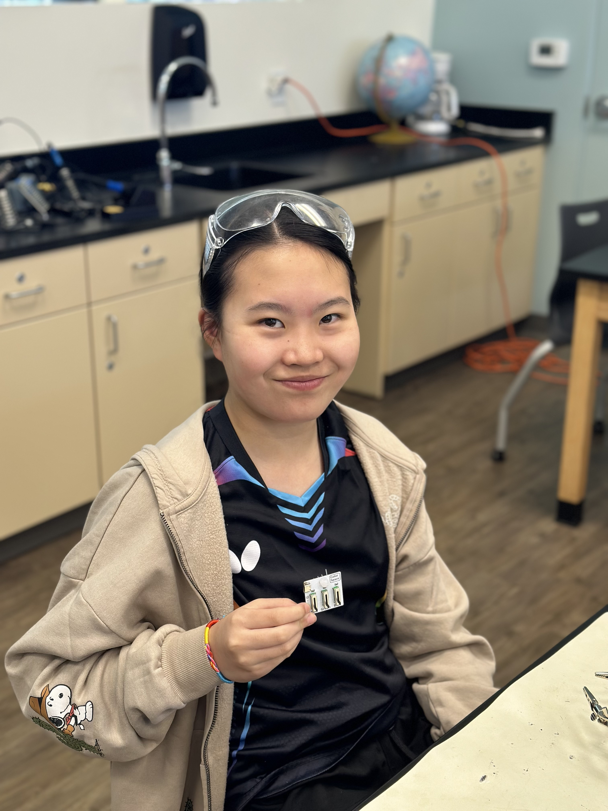
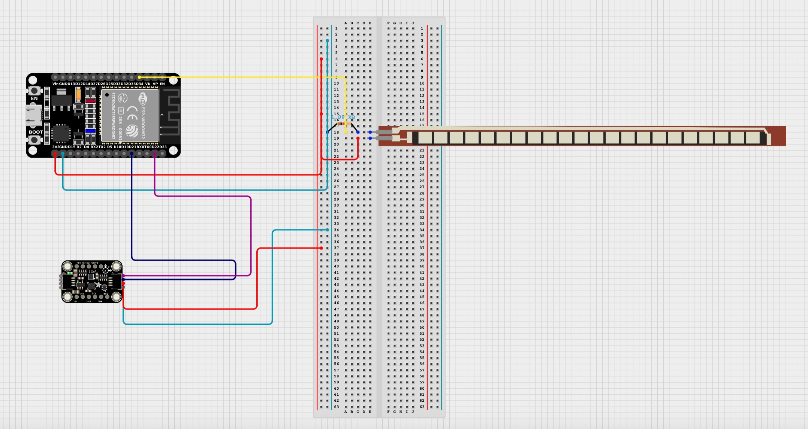

# Wrist Rehabilitation Device
Replace this text with a brief description (2-3 sentences) of your project. This description should draw the reader in and make them interested in what you've built. You can include what the biggest challenges, takeaways, and triumphs from completing the project were. As you complete your portfolio, remember your audience is less familiar than you are with all that your project entails!

You should comment out all portions of your portfolio that you have not completed yet, as well as any instructions:
```HTML 
<!--- This is an HTML comment in Markdown -->
<!--- Anything between these symbols will not render on the published site -->
``` 

| **Engineer** | **School** | **Area of Interest** | **Grade** |
|:--:|:--:|:--:|:--:|
| Danica H | Monta Vista High School | Electrical Engineering | Incoming Junior

<!--- **Replace the BlueStamp logo below with an image of yourself and your completed project. Follow the guide [here](https://tomcam.github.io/least-github-pages/adding-images-github-pages-site.html) if you need help.** -->


  
# Final Milestone

<!--- **Don't forget to replace the text below with the embedding for your milestone video. Go to Youtube, click Share -> Embed, and copy and paste the code to replace what's below.** -->

<iframe width="560" height="315" src="https://www.youtube.com/embed/F7M7imOVGug" title="YouTube video player" frameborder="0" allow="accelerometer; autoplay; clipboard-write; encrypted-media; gyroscope; picture-in-picture; web-share" allowfullscreen></iframe>

<!--- For your final milestone, explain the outcome of your project. Key details to include are:
- What you've accomplished since your previous milestone
- What your biggest challenges and triumphs were at BSE
- A summary of key topics you learned about
- What you hope to learn in the future after everything you've learned at BSE -->


# Second Milestone

<!--- **Don't forget to replace the text below with the embedding for your milestone video. Go to Youtube, click Share -> Embed, and copy and paste the code to replace what's below.** -->

<iframe width="560" height="315" src="https://www.youtube.com/embed/y3VAmNlER5Y" title="YouTube video player" frameborder="0" allow="accelerometer; autoplay; clipboard-write; encrypted-media; gyroscope; picture-in-picture; web-share" allowfullscreen></iframe>

<!--- For your second milestone, explain what you've worked on since your previous milestone. You can highlight:
- Technical details of what you've accomplished and how they contribute to the final goal
- What has been surprising about the project so far
- Previous challenges you faced that you overcame
- What needs to be completed before your final milestone -->

# First Milestone

<iframe width="560" height="315" src="https://www.youtube.com/embed/6mwKerqYJog?si=9e9g_ttw-0v3EGIk" title="YouTube video player" frameborder="0" allow="accelerometer; autoplay; clipboard-write; encrypted-media; gyroscope; picture-in-picture; web-share" referrerpolicy="strict-origin-when-cross-origin" allowfullscreen></iframe>

## Description
For my first milestone, I figured out how to code and wire both the flex sensor and the accelerometer and make them detect when an angle is bad for my wrist. I coded both of them to tell me if I bended my wrist too far back or too far forward. How it works is that the flex sensor is a resistor, and the more it bends the more resistance it will apply. It sends data as analog data, so I had to attach it to a pin that would convert the data to understandable digital data. I then used a few equations to find out the range of resistances between when the sensor is straight and when it is bent to 90 degrees, and then used the map function to convert those resistances to the angle the sensor was bent at. I set the threshold to 30 degrees, which means if the flex sensor ever bends past 30 degrees the computer will print out a message to fix my wrist posturer. For the accelerometer, since it measures both rotation speed and acceleration in 3 axes and outputs 6 values, I used a Madgwick filter to help convert all of those values into the positions of the object along the roll, yaw, and pitch axes. I again set a threshold for those values which will also indicate if I need to fix my posture.

## Challenges
One of the challenges was I had was adjusting the conversion equations. The ones I found online were for the Arduino Uno board, and since I'm using the ESP32 board, the equations were giving me the wrong values. I had to adjust the voltage and the digital value range. But after I adjusted the values, another problem happened. As I bent the flex sensor, the output values would get smaller instead of larger. After analyzing the equations, I concluded I needed to switch the positions of my resistor and my flex sensor, as the way I had originally placed them to send incorrect values to the equation. Another challenge was that the accelerometer was giving me 6 values at a time and I didn't know which of the 6 to use. I realized that Arduino has a library called Madgwick that actually filters those 6 values and gives you the position of the accelerometer along the roll, yaw, and pitch axes. I ended up using that filter and using the values it gave me to set a threshold.

## Next Steps

For my next steps, I will first add a piezo buzzer to my esp32 so that it will buzz whenever my wrist is too bent. I will also try and incorporate Bluetooth into my project so that the device can wirelessly transmit data to the computer.

## Schematic



## Code

```c++
// Basic demo for accelerometer/gyro readings from Adafruit LSM6DS3TR-C
const int flexPin = A6;
const int fixedResistance = 10000;
#include <MadgwickAHRS.h>
#include <Adafruit_LSM6DS3TRC.h>

// For SPI mode, we need a CS pin
#define LSM_CS 10
// For software-SPI mode we need SCK/MOSI/MISO pins
#define LSM_SCK 13
#define LSM_MISO 12
#define LSM_MOSI 11

Adafruit_LSM6DS3TRC lsm6ds3trc;
Madgwick filter;

void setup(void) {
  Serial.begin(115200);
  filter.begin(10);
  while (!Serial)
    delay(10); // will pause Zero, Leonardo, etc until serial console opens

  Serial.println("Adafruit LSM6DS3TR-C test!");

  if (!lsm6ds3trc.begin_I2C()) {
    // if (!lsm6ds3trc.begin_SPI(LSM_CS)) {
    // if (!lsm6ds3trc.begin_SPI(LSM_CS, LSM_SCK, LSM_MISO, LSM_MOSI)) {
    Serial.println("Failed to find LSM6DS3TR-C chip");
    while (1) {
      delay(10);
    }
  }

  Serial.println("LSM6DS3TR-C Found!");

  // lsm6ds3trc.setAccelRange(LSM6DS_ACCEL_RANGE_2_G);
  Serial.print("Accelerometer range set to: ");
  switch (lsm6ds3trc.getAccelRange()) {
  case LSM6DS_ACCEL_RANGE_2_G:
    Serial.println("+-2G");
    break;
  case LSM6DS_ACCEL_RANGE_4_G:
    Serial.println("+-4G");
    break;
  case LSM6DS_ACCEL_RANGE_8_G:
    Serial.println("+-8G");
    break;
  case LSM6DS_ACCEL_RANGE_16_G:
    Serial.println("+-16G");
    break;
  }

  // lsm6ds3trc.setGyroRange(LSM6DS_GYRO_RANGE_250_DPS);
  Serial.print("Gyro range set to: ");
  switch (lsm6ds3trc.getGyroRange()) {
  case LSM6DS_GYRO_RANGE_125_DPS:
    Serial.println("125 degrees/s");
    break;
  case LSM6DS_GYRO_RANGE_250_DPS:
    Serial.println("250 degrees/s");
    break;
  case LSM6DS_GYRO_RANGE_500_DPS:
    Serial.println("500 degrees/s");
    break;
  case LSM6DS_GYRO_RANGE_1000_DPS:
    Serial.println("1000 degrees/s");
    break;
  case LSM6DS_GYRO_RANGE_2000_DPS:
    Serial.println("2000 degrees/s");
    break;
  case ISM330DHCX_GYRO_RANGE_4000_DPS:
    break; // unsupported range for the DS33
  }

  // lsm6ds3trc.setAccelDataRate(LSM6DS_RATE_12_5_HZ);
  Serial.print("Accelerometer data rate set to: ");
  switch (lsm6ds3trc.getAccelDataRate()) {
  case LSM6DS_RATE_SHUTDOWN:
    Serial.println("0 Hz");
    break;
  case LSM6DS_RATE_12_5_HZ:
    Serial.println("12.5 Hz");
    break;
  case LSM6DS_RATE_26_HZ:
    Serial.println("26 Hz");
    break;
  case LSM6DS_RATE_52_HZ:
    Serial.println("52 Hz");
    break;
  case LSM6DS_RATE_104_HZ:
    Serial.println("104 Hz");
    break;
  case LSM6DS_RATE_208_HZ:
    Serial.println("208 Hz");
    break;
  case LSM6DS_RATE_416_HZ:
    Serial.println("416 Hz");
    break;
  case LSM6DS_RATE_833_HZ:
    Serial.println("833 Hz");
    break;
  case LSM6DS_RATE_1_66K_HZ:
    Serial.println("1.66 KHz");
    break;
  case LSM6DS_RATE_3_33K_HZ:
    Serial.println("3.33 KHz");
    break;
  case LSM6DS_RATE_6_66K_HZ:
    Serial.println("6.66 KHz");
    break;
  }

  // lsm6ds3trc.setGyroDataRate(LSM6DS_RATE_12_5_HZ);
  Serial.print("Gyro data rate set to: ");
  switch (lsm6ds3trc.getGyroDataRate()) {
  case LSM6DS_RATE_SHUTDOWN:
    Serial.println("0 Hz");
    break;
  case LSM6DS_RATE_12_5_HZ:
    Serial.println("12.5 Hz");
    break;
  case LSM6DS_RATE_26_HZ:
    Serial.println("26 Hz");
    break;
  case LSM6DS_RATE_52_HZ:
    Serial.println("52 Hz");
    break;
  case LSM6DS_RATE_104_HZ:
    Serial.println("104 Hz");
    break;
  case LSM6DS_RATE_208_HZ:
    Serial.println("208 Hz");
    break;
  case LSM6DS_RATE_416_HZ:
    Serial.println("416 Hz");
    break;
  case LSM6DS_RATE_833_HZ:
    Serial.println("833 Hz");
    break;
  case LSM6DS_RATE_1_66K_HZ:
    Serial.println("1.66 KHz");
    break;
  case LSM6DS_RATE_3_33K_HZ:
    Serial.println("3.33 KHz");
    break;
  case LSM6DS_RATE_6_66K_HZ:
    Serial.println("6.66 KHz");
    break;
  }

  lsm6ds3trc.configInt1(false, false, true); // accelerometer DRDY on INT1
  lsm6ds3trc.configInt2(false, true, false); // gyro DRDY on INT2
}

void loop() {
  // Get a new normalized sensor event
  sensors_event_t accel;
  sensors_event_t gyro;
  sensors_event_t temp;
  lsm6ds3trc.getEvent(&accel, &gyro, &temp);

  // Serial.print("\t\tTemperature ");
  // Serial.print(temp.temperature);
  // Serial.println(" deg C");

  // /* Display the results (acceleration is measured in m/s^2) */
  // Serial.print("\t\tAccel X: ");
  // Serial.print(accel.acceleration.x);
  // Serial.print(" \tY: ");
  // Serial.print(accel.acceleration.y);
  // Serial.print(" \tZ: ");
  // Serial.print(accel.acceleration.z);
  // Serial.println(" m/s^2 ");

  // /* Display the results (rotation is measured in rad/s) */
  // Serial.print("\t\tGyro X: ");
  // Serial.print(gyro.gyro.x);
  // Serial.print(" \tY: ");
  // Serial.print(gyro.gyro.y);
  // Serial.print(" \tZ: ");
  // Serial.print(gyro.gyro.z);
  // Serial.println(" radians/s ");
  // Serial.println();

  int flexValue;
  flexValue = analogRead(flexPin);
  float voltage = flexValue * (3.3/4095.0);
  float flexResistance = fixedResistance * (3.3/voltage - 1.0);
  //Serial.println(flexResistance);
  float angle = map(flexResistance, 12000, 28000, 0.0, 90.0);
  Serial.print("angle: ");
  Serial.println(String(angle) + " degrees");
  

  filter.updateIMU(gyro.gyro.x, gyro.gyro.y, gyro.gyro.z, accel.acceleration.x, accel.acceleration.y, accel.acceleration.z);
  Serial.print("Filter angles: ");
  Serial.print(filter.getRoll());
  Serial.print(" ");
  Serial.print(filter.getYaw());
  Serial.print(" ");
  Serial.println(filter.getPitch());
  
  if (filter.getPitch() < -35 || filter.getPitch() > 30 || angle > 30 || angle < -5) {
    Serial.println("fix posture");
  }


  delay(100);

  //  // serial plotter friendly format

  //  Serial.print(temp.temperature);
  //  Serial.print(",");

  //  Serial.print(accel.acceleration.x);
  //  Serial.print(","); Serial.print(accel.acceleration.y);
  //  Serial.print(","); Serial.print(accel.acceleration.z);
  //  Serial.print(",");

  // Serial.print(gyro.gyro.x);
  // Serial.print(","); Serial.print(gyro.gyro.y);
  // Serial.print(","); Serial.print(gyro.gyro.z);
  // Serial.println();
  //  delayMicroseconds(10000);
}
```

# Starter Project

<iframe width="560" height="315" src="https://www.youtube.com/embed/5wEY8PIAxxw?si=gzU_WiEb7dDwkuhB" title="YouTube video player" frameborder="0" allow="accelerometer; autoplay; clipboard-write; encrypted-media; gyroscope; picture-in-picture; web-share" referrerpolicy="strict-origin-when-cross-origin" allowfullscreen></iframe>

## Description
For my starter project, I decided to make the RGB slider, which is a small board with sliders and an LED light. Based on which slider I turn up, the LED at the top of the board will turn that color. To make it, I had solder on the sliders, LED light, and the USB-C port. In total I had to solder 29 joints to make sure currents would flow properly. How it works is that the sliders are all resistors, and when they are turned down the resistance is high enough as to not allow any current to pass through. But, once they are turned up the resistance of the sliders decrease, hence allowing the current to pass through and light up the LED. 

## Challenges

One of the challenges I had was that I accidentally soldered one of the holes wrong, so I had to use a pump to desolder the metal. I almost burned myself in the process. The other challenge I had was that I didn't know I had to use a specific USB-C cable that only passes one voltage through. The ones I used usually negotiate with the receiver about which voltage to pass though and the receiver will adjust with what it gets. But, since the RGB doesn't adjust the voltage it gets, the cable got confused on how much voltage to give it. I also had tried using my computer as the power generator, but it also didn't know how much voltage to pass through the board. Eventually I used a cable that only passed one voltage through and it worked fine. 

## Next Steps

For my next project, I will begin working on my wrist rehabilitation device using the skills I learned from my starter project.

# Schematics 
<!--- Here's where you'll put images of your schematics. [Tinkercad](https://www.tinkercad.com/blog/official-guide-to-tinkercad-circuits) and [Fritzing](https://fritzing.org/learning/) are both great resoruces to create professional schematic diagrams, though BSE recommends Tinkercad becuase it can be done easily and for free in the browser. -->

# Code
<!--- Here's where you'll put your code. The syntax below places it into a block of code. Follow the guide [here]([url](https://www.markdownguide.org/extended-syntax/)) to learn how to customize it to your project needs. -->

```c++
void setup() {
  // put your setup code here, to run once:
  Serial.begin(9600);
  Serial.println("Hello World!");
}

void loop() {
  // put your main code here, to run repeatedly:

}
```

# Bill of Materials
<!--- Here's where you'll list the parts in your project. To add more rows, just copy and paste the example rows below.
Don't forget to place the link of where to buy each component inside the quotation marks in the corresponding row after href =. Follow the guide [here]([url](https://www.markdownguide.org/extended-syntax/)) to learn how to customize this to your project needs. -->

| **Part** | **Note** | **Price** | **Link** |
|:--:|:--:|:--:|:--:|
| Item Name | What the item is used for | $Price | <a href="https://www.amazon.com/Arduino-A000066-ARDUINO-UNO-R3/dp/B008GRTSV6/"> Link </a> |
| Item Name | What the item is used for | $Price | <a href="https://www.amazon.com/Arduino-A000066-ARDUINO-UNO-R3/dp/B008GRTSV6/"> Link </a> |
| Item Name | What the item is used for | $Price | <a href="https://www.amazon.com/Arduino-A000066-ARDUINO-UNO-R3/dp/B008GRTSV6/"> Link </a> |

<!--- # Other Resources/Examples
One of the best parts about Github is that you can view how other people set up their own work. Here are some past BSE portfolios that are awesome examples. You can view how they set up their portfolio, and you can view their index.md files to understand how they implemented different portfolio components.
- [Example 1](https://trashytuber.github.io/YimingJiaBlueStamp/)
- [Example 2](https://sviatil0.github.io/Sviatoslav_BSE/)
- [Example 3](https://arneshkumar.github.io/arneshbluestamp/)

To watch the BSE tutorial on how to create a portfolio, click here. -->
